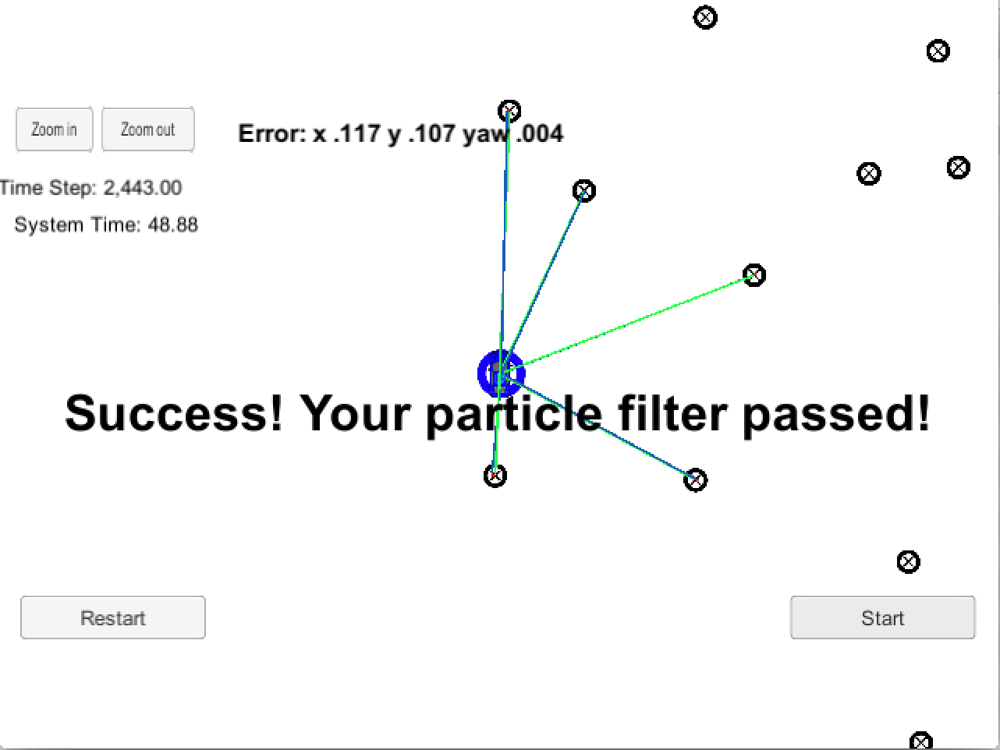

# Kidnapped Vehicle Project

## Project Introduction

Your robot has been kidnapped and transported to a new location! Luckily it has a map of this location, a (noisy) GPS estimate of its initial location, and lots of (noisy) sensor and control data.

In this project you will implement a 2 dimensional particle filter in C++. Your particle filter will be given a map and some initial localization information (analogous to what a GPS would provide). At each time step your filter will also get observation and control data.

## Implementation

The position of the vehicle is localised using a particle filter. It generally follows these steps:

1. Given an initial GPS position, generate a number of particles each representing a possible location of the vehicle.
1. Sensor measures the location of a number of landmark object w.r.t the car
1. Given the location of each generated particle and location of landmarks on a map associate each sensor observation with the nearest landmark
1. Calculate a weight for each particle such that the ones where the observation match up with landmark points are given larger weights.
1. Resample the particles according to their weights, such that particles with larger weights are more likely to be sampled.
1. Predict the position of particles after time delta t using a bicycle motion model.
1. Obtain sensor reading again after time delta t and repeat the process.

During each iteration the particle with largest weight was taken as the best guess of the location of the car on the map.

## Result

The algorithm localises the car very well. It is discovered that the more particles maintained in a population the more accurate the localisation. But even with just 10 particles, the vehicle was localised very well. There is a clear performance penalty for more particles.

